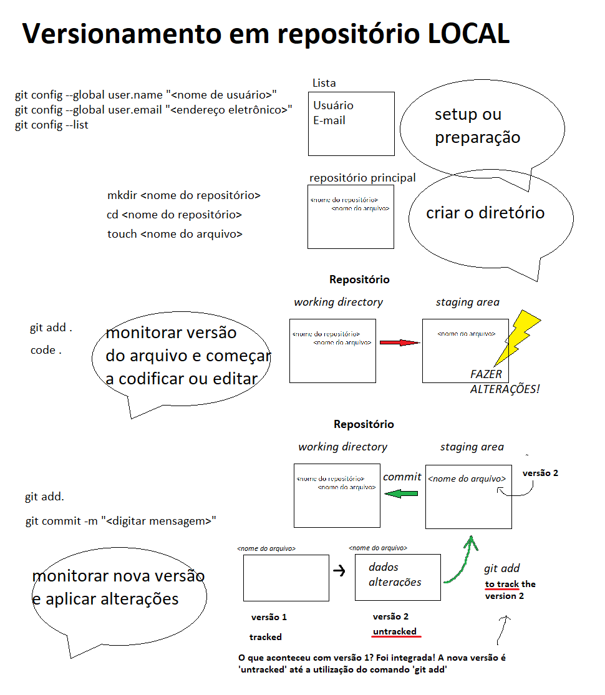

## Description
'Hello-world' is an exercise from GitHub website to practice GitHub flow. It's also my first repository.

## Image

## Table

|column1|column2|
|:---:|:---:|
|atrib_1|atrib_2|

## List
- Item1
- Item 2

## For local repository

